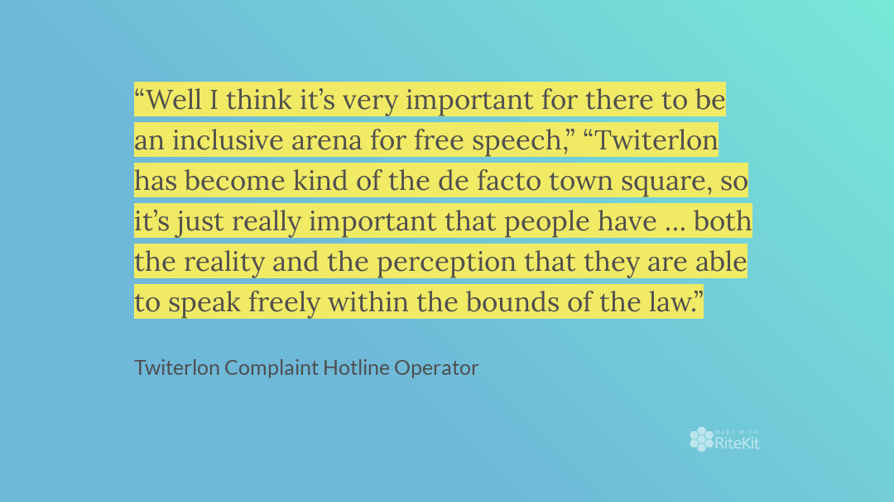

# Black Belt 2022 LATAM (DATABASE TRACK)

The Black Belt is a higher level of certification that represents deep experience rather than potentially crammed knowledge.

---
# Welcome to the Twiterlon STORE

# These are our microtransaction type products:

  

<b>
You can buy this badge for a cost of $99 one purchase, use forever
</b>

  

<b>
You can buy this badge for a cost of $50 renewed anually
</b>

  

<b>
OR, You can buy this badge for a cost of $10 monthly...
</b>

## Tick Mark Comparison Table

| **Tick Mark Color** | **Blue** | **Green** | **Yellow** |
|:-------------------:|:--------:|:---------:|:----------:|
|      **cost**       |    99    |    50     |     10     |
|     **expires**     |  NEVER   |  Yearly   |  Monthly   |
|    **currency**     |   USD    |    USD    |    USD     |

---

# Assets attribution

<a href="https://www.flaticon.com/free-icons/twitter" title="twitter icons">Twitter icons created by Freepik - Flaticon</a>

<a href="https://www.flaticon.com/free-icons/verified" title="verified icons">Verified icons created by kmg design - Flaticon</a>

<a href="https://www.flaticon.com/free-icons/check-mark" title="check mark icons">Check mark icons created by elvnsands - Flaticon</a>

<a href="https://www.flaticon.com/free-icons/check-mark" title="check mark icons">Check mark icons created by - Flaticon</a>

---

---